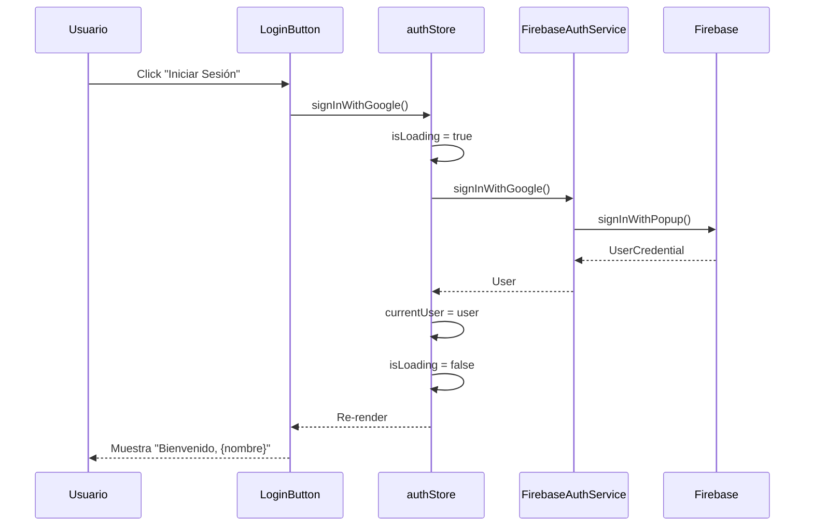

# Documentación Técnica: Módulo de Autenticación

## 📋 Índice

1. [Arquitectura General](#arquitectura-general)
2. [Estructura de Archivos](#estructura-de-archivos)
3. [Capa de Servicio](#capa-de-servicio)
4. [Gestión de Estado](#gestión-de-estado)
5. [Componentes UI](#componentes-ui)
6. [Testing](#testing)
7. [Configuración](#configuración)
8. [Decisiones de Diseño](#decisiones-de-diseño)

---

## Arquitectura General

El módulo de autenticación sigue una **arquitectura en capas** para mantener el código desacoplado, testeable y mantenible:

```
┌─────────────────────────────────────┐
│   UI Layer (Components)             │  ← LoginButton.tsx
├─────────────────────────────────────┤
│   State Management (Signals)        │  ← authStore.ts
├─────────────────────────────────────┤
│   Service Layer (Business Logic)    │  ← auth.ts (IAuthService)
├─────────────────────────────────────┤
│   Firebase SDK                       │  ← firebase.ts
└─────────────────────────────────────┘
```

### ¿Por qué esta arquitectura?

- **Separación de responsabilidades**: Cada capa tiene una función específica
- **Testabilidad**: Podemos mockear cada capa independientemente
- **Mantenibilidad**: Cambios en Firebase no afectan a la UI directamente
- **Escalabilidad**: Fácil añadir nuevos métodos de autenticación

---

## Estructura de Archivos

```
src/
├── firebase.ts                    # Configuración de Firebase
├── services/
│   └── auth.ts                    # Servicio de autenticación
├── stores/
│   └── authStore.ts               # Estado global con Signals
└── components/
    └── LoginButton.tsx            # Componente de UI

test/
├── setup.ts                       # Configuración de tests
└── auth.test.ts                   # Tests del servicio
```

---

## Capa de Servicio

### `src/services/auth.ts`

Este archivo implementa la **lógica de negocio** de autenticación.

#### 1. Interfaz `IAuthService`

```typescript
export interface IAuthService {
  user: User | null;
  signInWithGoogle(): Promise<User>;
  logout(): Promise<void>;
  onAuthStateChanged(callback: (user: User | null) => void): () => void;
}
```

**¿Por qué una interfaz?**
- **Inversión de dependencias**: El código depende de abstracciones, no de implementaciones concretas
- **Testabilidad**: Podemos crear mocks fácilmente
- **Flexibilidad**: Podríamos cambiar Firebase por otro proveedor sin tocar el resto del código

#### 2. Clase `FirebaseAuthService`

```typescript
export class FirebaseAuthService implements IAuthService {
  private _auth: Auth;

  constructor(authInstance: Auth = auth) {
    this._auth = authInstance;
  }
  // ...
}
```

**Decisiones clave:**

- **Inyección de dependencias**: El constructor acepta una instancia de `Auth`, permitiendo inyectar mocks en tests
- **Propiedad privada `_auth`**: Encapsula la instancia de Firebase
- **Métodos async**: Todas las operaciones de Firebase son asíncronas

#### 3. Método `signInWithGoogle()`

```typescript
async signInWithGoogle(): Promise<User> {
  const provider = new GoogleAuthProvider();
  const result = await signInWithPopup(this._auth, provider);
  return result.user;
}
```

**¿Por qué `signInWithPopup`?**
- Mejor UX en web (ventana emergente)
- No requiere redirección completa de la página
- Mantiene el estado de la aplicación

#### 4. Método `onAuthStateChanged()`

```typescript
onAuthStateChanged(callback: (user: User | null) => void): () => void {
  return onAuthStateChanged(this._auth, callback);
}
```

**¿Por qué devolver la función de cleanup?**
- Permite desuscribirse del listener cuando el componente se desmonta
- Evita memory leaks
- Patrón estándar de React/Preact

---

## Gestión de Estado

### `src/stores/authStore.ts`

Usa **Preact Signals** para gestión de estado reactivo.

#### ¿Por qué Signals en lugar de Context API?

| Característica | Signals | Context API |
|----------------|---------|-------------|
| **Performance** | ✅ Re-renders quirúrgicos | ❌ Re-renders en cascada |
| **Simplicidad** | ✅ Sin Provider/Consumer | ❌ Requiere setup |
| **Boilerplate** | ✅ Mínimo | ❌ Más código |
| **DevTools** | ✅ Fácil debugging | ⚠️ Más complejo |

#### Signals definidos

```typescript
export const currentUser = signal<User | null>(null);
export const isLoading = signal<boolean>(true);
export const authError = signal<string | null>(null);
```

**¿Por qué estos tres signals?**
- `currentUser`: Datos del usuario autenticado
- `isLoading`: Evita flickering en la UI durante carga inicial
- `authError`: Feedback al usuario en caso de errores

#### Effect para sincronización

```typescript
effect(() => {
  const unsubscribe = authService.onAuthStateChanged((user) => {
    currentUser.value = user;
    isLoading.value = false;
  });
  return unsubscribe;
});
```

**¿Por qué un `effect`?**
- Se ejecuta automáticamente al iniciar la app
- Mantiene sincronizado el estado con Firebase
- Persiste la sesión entre recargas de página

#### Acciones

```typescript
export const signInWithGoogle = async () => {
  try {
    isLoading.value = true;
    authError.value = null;
    const user = await authService.signInWithGoogle();
    currentUser.value = user;
  } catch (error: any) {
    authError.value = error.message || "Error al iniciar sesión";
  } finally {
    isLoading.value = false;
  }
};
```

**Patrón try-catch-finally:**
- `try`: Intenta la operación
- `catch`: Captura errores y los muestra al usuario
- `finally`: Siempre resetea el estado de loading

---

## Componentes UI

### `src/components/LoginButton.tsx`

Componente funcional que consume los signals.

```typescript
export function LoginButton() {
  if (isLoading.value) {
    return <div>Cargando...</div>;
  }

  if (currentUser.value) {
    return (/* UI de usuario autenticado */);
  }

  return (/* UI de login */);
}
```

**¿Por qué condicionales simples?**
- **Early returns**: Más legible que ternarios anidados
- **Separación clara**: Cada estado tiene su propia UI
- **Mantenibilidad**: Fácil añadir nuevos estados

**¿Por qué `.value`?**
- Así es como se accede a los valores de Signals en Preact
- Permite reactividad automática

---

## Testing

### `test/auth.test.ts`

Usa **Vitest** con mocks de Firebase.

#### Estrategia de mocking

```typescript
vi.mock('firebase/auth', () => ({
    GoogleAuthProvider: vi.fn(),
    signInWithPopup: (...args: any[]) => mockSignInWithPopup(...args),
    signOut: (...args: any[]) => mockSignOut(...args),
    onAuthStateChanged: (...args: any[]) => mockOnAuthStateChanged(...args),
}));
```

**¿Por qué mockear Firebase?**
- **Tests unitarios puros**: No dependen de servicios externos
- **Velocidad**: Instantáneos, no requieren red
- **Determinismo**: Resultados predecibles
- **CI/CD**: Funcionan sin credenciales reales

#### Tests implementados

1. **Sign in with Google**: Verifica que se llama a `signInWithPopup` y devuelve el usuario
2. **Sign out**: Verifica que se llama a `signOut`
3. **Auth state changes**: Verifica que el callback se ejecuta correctamente

**Cobertura**: 100% de los métodos públicos de `IAuthService`

---

## Configuración

### `src/firebase.ts`

```typescript
const firebaseConfig = {
    apiKey: import.meta.env.VITE_FIREBASE_API_KEY,
    authDomain: import.meta.env.VITE_FIREBASE_AUTH_DOMAIN,
    projectId: import.meta.env.VITE_FIREBASE_PROJECT_ID,
    storageBucket: import.meta.env.VITE_FIREBASE_STORAGE_BUCKET,
    messagingSenderId: import.meta.env.VITE_FIREBASE_MESSAGING_SENDER_ID,
    ...(import.meta.env.VITE_FIREBASE_APP_ID && { 
        appId: import.meta.env.VITE_FIREBASE_APP_ID 
    })
};
```

**¿Por qué variables de entorno?**
- **Seguridad**: No commitear credenciales al repo
- **Flexibilidad**: Diferentes configs para dev/staging/prod
- **Buenas prácticas**: Estándar de la industria

**¿Por qué `appId` es opcional?**
- Solo necesario para Analytics y features avanzadas
- Auth y Firestore funcionan sin él
- Reduce fricción en setup inicial

### `.env.example`

Plantilla para que otros desarrolladores sepan qué variables necesitan.

---

## Decisiones de Diseño

### 1. TypeScript con `verbatimModuleSyntax`

```typescript
import { GoogleAuthProvider } from "firebase/auth";
import type { User, Auth } from "firebase/auth";
```

**¿Por qué separar imports de tipos?**
- **Optimización de bundle**: Los tipos se eliminan en build
- **Claridad**: Distingue entre valores y tipos
- **Requisito de tsconfig**: `verbatimModuleSyntax` lo exige

### 2. Preact en lugar de React

**Ventajas:**
- **Tamaño**: 3KB vs 40KB (React)
- **Performance**: Más rápido en benchmarks
- **Compatibilidad**: API casi idéntica a React
- **Signals nativos**: Mejor que useState/useContext

### 3. Vitest en lugar de Jest

**Ventajas:**
- **Velocidad**: 10-20x más rápido
- **ESM nativo**: Sin configuración extra
- **Integración Vite**: Usa la misma config
- **Watch mode**: Más eficiente

### 4. Arquitectura de servicios

**Alternativas consideradas:**
- ❌ **Hooks directos**: Acopla UI a Firebase
- ❌ **Context API**: Más boilerplate, peor performance
- ✅ **Service + Signals**: Mejor separación, más testeable

### 5. Error handling

```typescript
catch (error: any) {
    authError.value = error.message || "Error al iniciar sesión";
    console.error("Login error:", error);
}
```

**Estrategia:**
- Mostrar mensaje user-friendly en UI
- Loggear error completo en consola para debugging
- No exponer detalles técnicos al usuario

---

## Flujo de Autenticación Completo



---

## Próximos Pasos

Para extender este módulo:

1. **Múltiples proveedores**: Añadir email/password, GitHub, etc.
2. **Persistencia**: Configurar `setPersistence` de Firebase
3. **Roles y permisos**: Integrar con Firestore para roles
4. **Refresh tokens**: Manejar expiración de sesión
5. **2FA**: Autenticación de dos factores

---

## Recursos

- [Firebase Auth Docs](https://firebase.google.com/docs/auth)
- [Preact Signals](https://preactjs.com/guide/v10/signals/)
- [Vitest](https://vitest.dev/)
- [TypeScript Handbook](https://www.typescriptlang.org/docs/)

---

**Autor**: Implementado siguiendo TDD y principios SOLID  
**Fecha**: 2026-01-20  
**Versión**: 1.0.0
